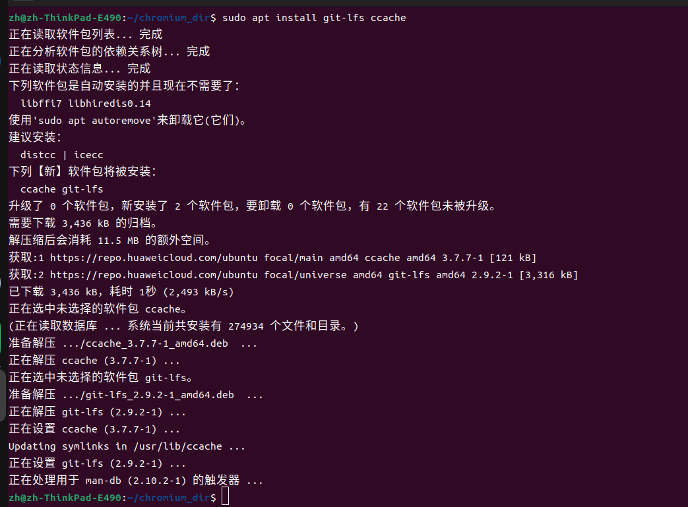
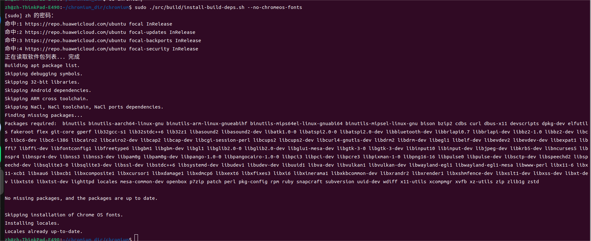
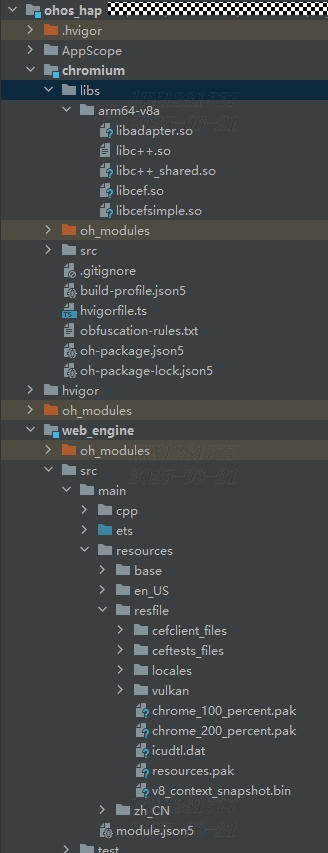
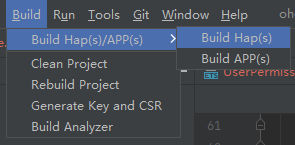
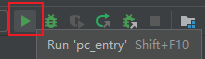
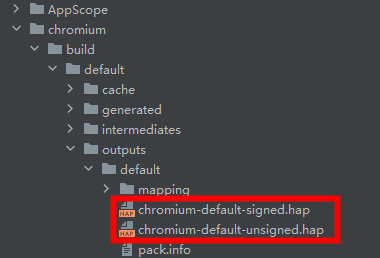
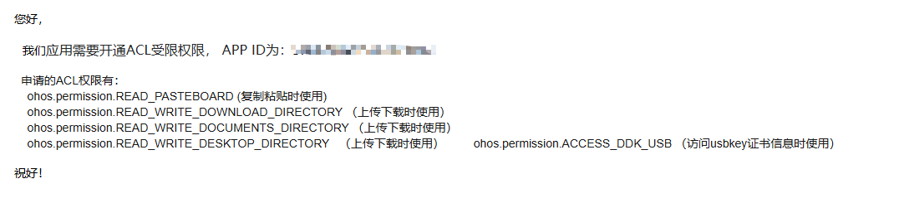
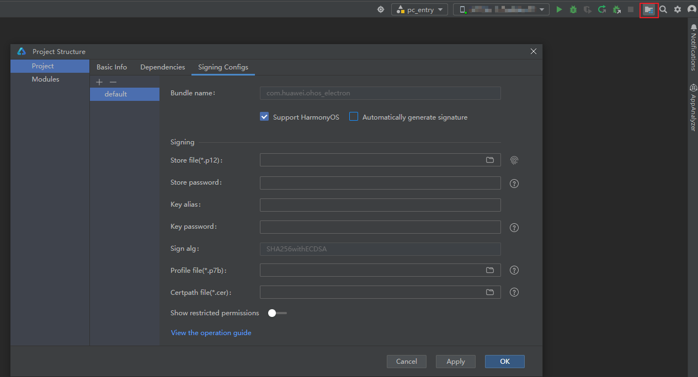
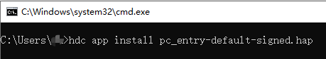
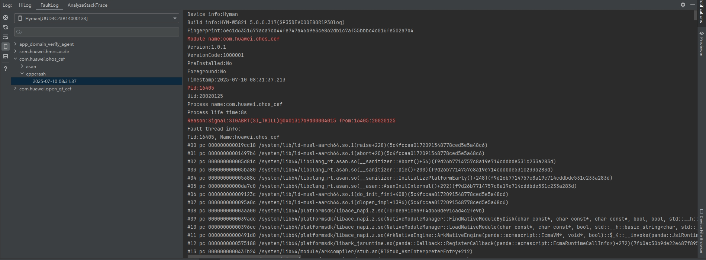

# CEF鸿蒙化指导文档

[TOC]

## 环境配置

操作系统：Ubuntu 22.04

磁盘空间：大于100G

内存：大于8G

CPU架构：x86_64


## 编译源码构建应用
### 源码与工具下载安装

#### 工具安装

1. 代码仓库网址

[master](https://gitcode.com/openharmony-tpc/chromium_cef/tree/pc_chromium_132)


2. 安装工具`git-lfs`, `ccache` 。**注：该步骤仅在首次拉取代码时需要执行**

   ```sh
   # 安装 git-lfs，确保仓库中的大文件能拉取到本地。ccache 为编译器缓存。
   $ sudo apt install git-lfs ccache
   ```



3. 配置工具`repo` 。**注：该步骤仅在首次拉取代码时需要执行，执行该步骤前请确保已经配置好了python3环境**

   ```sh
   # 下载码云repo工具(可以参考码云帮助中心：https://gitee.com/help/articles/4316)
   $ mkdir -p ~/bin
   $ curl https://gitee.com/oschina/repo/raw/fork_flow/repo-py3 > ~/bin/repo
   $ chmod a+x ~/bin/repo
   $ echo 'export PATH=~/bin/:$PATH' >> ~/.bashrc
   $ source ~/.bashrc
   $ pip install -i https://pypi.tuna.tsinghua.edu.cn/simple requests
   ```


#### 拉取chromium-cef仓库代码

1. 从代码仓克隆chromium-cef仓库。

   ```sh
   # 使用https拉取chromium-cef代码
   $ cd [path_to_chromium_cef]
   $ git clone -b pc_chromium_132 https://gitcode.com/openharmony-tpc/chromium_cef.git
   
   # 执行命令`git lfs pull`，确保仓库中的大文件已经下载完成
   $ git lfs pull
   
   # 拉取chromium-cef对应的ohos chromium代码
   $ cd [path_to_chromium]   # 切换目录到chromium根目录
   $ repo init -u  https://gitcode.com/openharmony-tpc/manifest.git -b pc_chromium_132 -m chromium.xml --no-repo-verify
   $ repo sync -c  # 可以执行多次，以确保代码全部拉取成功
   $ repo forall -c 'git lfs pull'  # 可执行多次，以确保大文件全部拉取成功
   
   # 应用chromium-cef的patch到ohos chromium
   $ cd [path_to_chromium_cef]   # 切换目录到chromium-cef根目录
   $ chmod +x apply_cef_patchs.sh
   $ ./apply_cef_patchs.sh [path_to_chromium]/src [path_to_chromium_cef]  #脚本需要输入两个路径，第一个是chromium代码下的src的路径，第二个是下载的cef的路径
   ```
   
2. 运行 cef实际目录/src/build/install-build-deps.sh脚本，安装编译所需的软件包。**注：该步骤仅在首次拉取代码时需要执行**

   ```sh
   $ sudo ./src/build/install-build-deps.sh --no-chromeos-fonts
   ```

   

3. 运行脚本`build.sh`编译cef。

```sh
$ ./build.sh
```


### 输出结果

编译完成后，会在src/out/musl_64目录下输出的编译产物文件如下：

> cefclient_files  
> ceftests_files  
> locales  
> chrome_100_percent.pak  
> chrome_200_percent.pak  
> icudtl.dat  
> resources.pak  
> v8_context_snapshot.bin  
> libadapter.so  
> libcef.so  
> libcefsimple.so  

可以通过如下脚本拷贝所需资源(注：请参考修改为自己的source_path)

```sh
#!/bin/sh
source_path=./cef实际目录/src/out/musl_64
destination_path=./cef
if [ -d ${destination_path} ];then
	rm -rf ${destination_path}
fi
mkdir ${destination_path}
cp -r ${source_path}/cefclient_files ${destination_path}
cp -r ${source_path}/ceftests_files ${destination_path}
cp ${source_path}/chrome_100_percent.pak ${destination_path}
cp ${source_path}/chrome_200_percent.pak ${destination_path}
cp ${source_path}/icudtl.dat  ${destination_path}
cp ${source_path}/v8_context_snapshot.bin ${destination_path}
cp ${source_path}/libadapter.so ${destination_path}
cp ${source_path}/libcef.so ${destination_path}
cp ${source_path}/libcefsimple.so ${destination_path}
mkdir ${destination_path}/locales
cp ${source_path}/locales/zh-CN.pak ${destination_path}/locales
cp ${source_path}/locales/en-US.pak ${destination_path}/locales
```

将脚本保存为copy.sh放置于编译文件夹chromium文件夹同级，并执行，执行脚本后会将所需资源拷贝到同级的cef中。


## hap包构建与使用
hap包工程位置：源码目录src/ohos/app/文件夹内。

### 编译未签名的hap包

在工程中新建**chromium/libs/arm64-v8a**文件夹，替换**chromium/libs/arm64-v8a**目录与**web_engine/src/main/resources/resfile**目录下的资源，并使用DevEco Studio进行编译安装。

**libc++_shared.so**位于OHOS系统sdk中，路径：**command-line-tools\sdk\default\openharmony\native\llvm\lib\aarch64-linux-ohos**

资源文件放置后，目录结构如下：



so库与resfile都放入指定位置后，点击 **Build -> Build Hap(s)/APP(s) -> Build Hap(s)** 按钮编译生成未签名的hap包或点击**右上角运行按钮**启动应用。





编译完成后，未签名的hap包会被保存到**ohos_hap/chromium/build/default/outputs/default/**下，文件名**chromium-default-unsigned.hap**。



### 签名与权限  

[应用/服务签名-DevEco Studio - 华为HarmonyOS开发者 (huawei.com)](https://developer.huawei.com/consumer/cn/doc/harmonyos-guides-V5/ide-signing-V5)

权限申请邮件内容示例如下：

**请根据实际需要的授权申请权限，示例内容仅供参考**



权限配置文件位置：**ohos_hap\web_engine\src\main\module.json5**文件中**requestPermissions**字段，以下是当前声明的权限及说明。

| 权限名                                                | 权限说明                                                     | 必要性       |
| :---------------------------------------------------- | ------------------------------------------------------------ | :----------- |
| ohos.permission.SYSTEM_FLOAT_WINDOW                   | 允许应用使用全局悬浮窗的能力。                               | 按需申请     |
| ohos.permission.INTERNET                              | 允许使用Internet网络。                                       | **基础权限** |
| ohos.permission.GET_NETWORK_INFO                      | 允许应用获取数据网络信息。                                   | **基础权限** |
| ohos.permission.ACCESS_CERT_MANAGER                   | 允许应用进行查询证书及私有凭据等操作。                       | 按需申请     |
| ohos.permission.RUNNING_LOCK                          | 允许应用获取运行锁，保证应用在后台的持续运行                 | **基础权限** |
| ohos.permission.PRINT                                 | 允许应用获取打印框架的能力。                                 | 按需申请     |
| ohos.permission.PREPARE_APP_TERMINATE                 | 允许应用关闭前执行自定义的预关闭动作。                       | **基础权限** |
| ohos.permission.ACCESS_BIOMETRIC                      | 允许应用使用生物特征识别能力进行身份认证。                   | 按需申请     |
| ohos.permission.FILE_ACCESS_PERSIST                   | 允许应用支持持久化访问文件Uri。                              | **基础权限** |
| ohos.permission.PRIVACY_WINDOW                        | 允许应用将窗口设置为隐私窗口，禁止截屏录屏。                 | 按需申请     |
| ohos.permission.WINDOW_TOPMOST                        | 允许窗口置顶。                                               | 按需申请     |
| ohos.permission.READ_PASTEBOARD                       | 允许应用读取剪贴板。                                         | **基础权限** |
| ohos.permission.READ_WRITE_DOWNLOAD_DIRECTORY         | 允许应用访问公共目录下Download目录及子目录，建议与ohos.permission.FILE_ACCESS_PERSIST同时申请。 | 按需申请     |
| ohos.permission.READ_WRITE_DOCUMENTS_DIRECTORY        | 允许应用访问公共目录下Documents目录及子目录，建议与ohos.permission.FILE_ACCESS_PERSIST同时申请。 | 按需申请     |
| ohos.permission.READ_WRITE_DESKTOP_DIRECTORY          | 允许应用访问公共目录下Desktop目录及子目录，建议与ohos.permission.FILE_ACCESS_PERSIST同时申请。 | 按需申请     |
| ohos.permission.LOCATION                              | 允许应用获取设备位置信息。                                   | 按需申请     |
| ohos.permission.APPROXIMATELY_LOCATION                | 允许应用获取设备模糊位置信息。                               | 按需申请     |
| ohos.permission.LOCATION_IN_BACKGROUND                | 允许应用在后台运行时获取设备位置信息。                       | 按需申请     |
| ohos.permission.MICROPHONE                            | 允许应用使用麦克风。                                         | 按需申请     |
| ohos.permission.CAMERA                                | 允许应用使用相机。                                           | 按需申请     |
| ohos.permission.ACCESS_BLUETOOTH                      | 允许应用接入蓝牙并使用蓝牙能力，例如配对、连接外围设备等。   | 按需申请     |
| ohos.permission.CUSTOM_SCREEN_CAPTURE                 | 允许应用截取屏幕内容。                                       | 按需申请     |

cef中需要ACL签名的权限包括（如果未申请到证书导致签名未通过，可以暂时将这几个权限注释掉）：

```
"requestPermissions": [
      {
        "name": "ohos.permission.SYSTEM_FLOAT_WINDOW"
      },
      ...
      {
        "name": "ohos.permission.READ_PASTEBOARD",
        "reason": "$string:access_pasteboard",
      },
      ...
      {
        "name": "ohos.permission.READ_WRITE_DOWNLOAD_DIRECTORY",
        "reason": "$string:reason_download",
        "usedScene": {
          "abilities": [
            "FormAbility"
          ],
          "when":"always"
        }
      },
      {
        "name": "ohos.permission.READ_WRITE_DOCUMENTS_DIRECTORY",
        "reason": "$string:reason_documents",
        "usedScene": {
          "abilities": [
            "FormAbility"
          ],
          "when":"always"
        }
      },
      {
        "name": "ohos.permission.READ_WRITE_DESKTOP_DIRECTORY",
        "reason": "$string:reason_desktop",
        "usedScene": {
          "abilities": [
            "FormAbility"
          ],
          "when":"always"
        }
      }
    ]
```

### 运行已签名的hap包

申请证书后在DevEco Studio中配置



配置完成后点击右上角的run按钮即可运行


或者

在命令行中执行命令安装hap包

```sh
hdc app install <已签名hap包路径>
# e.g: hdc app install pc_entry-default-signed.hap
```




### 定制自己的鸿蒙版应用

NULL

## CEF鸿蒙特性说明

NULL

###  新增接口

NULL

### 调试应用

在使用命令行参数时，特别是那些涉及安全性的参数，需要谨慎操作以确保系统的安全性和稳定性，风险参数包括不限于命令行如下：

- `--remote-debugging-port`
  - 用途：启用远程调试功能，指定调试端口号。
  - 注意事项：确保调试端口仅在受信任的网络环境中开放，避免暴露在公共网络中，以防被恶意攻击。

- `--disable-web-security`
  - 用途：禁用同源策略，允许跨域请求。
  - 注意事项：仅在开发或测试环境中使用，切勿在生产环境中启用，以防止潜在的安全漏洞。

- `--no-sandbox`
  - 用途：禁用沙箱机制，降低进程隔离保护。
  - 注意事项：使用时需确保环境安全，避免恶意软件利用此配置进行攻击。

- `--ignore-certificate-errors`
  - 用途：忽略证书错误，允许自签名证书。
  - 注意事项：仅在受信任的环境中使用，避免在生产环境中启用，以防中间人攻击。

- `--gpu-launcher`
  - 用途：指定GPU进程的启动器命令。
  - 注意事项：主要用于高级调试或特定GPU配置，需了解其具体用法和潜在影响。

- `--inspect` 和 `--inspect-brk`
  - 用途：启动调试服务器，支持后台调试和启动时暂停。
  - 注意事项：避免在生产环境中使用，确保调试过程的安全性。

- `--host-rules`
  - 用途：配置网络请求的路由或重定向。
  - 注意事项：正确配置语法，确保网络请求的安全性和合规性。

总结：相关参数在开发和调试中非常有用，但需谨慎使用，确保环境安全，避免在生产环境中启用可能削弱安全性的参数。

### 上架问题

NULL

## 问题定位

**崩溃问题需要提供对应日构建版本（例如：20241229.1）或代码提交的commit-id（可以使用`git log`命令查看，例如：162a67b2a0a2a6f36e47d4e6c10cb780dd8c99b4）及崩溃堆栈信息（在DevEco Studio内点击下图中的保存按钮可以将信息保存到本地）。**




## 坚盾守护模式

坚盾守护模式是为高安全需求用户设计的系统级安全防护方案。该模式通过实施严格的功能限制，显著增强系统安全性，有效防范针对远程攻击面的各类威胁。在坚盾安全模式下，CEF增加了功能限制，需要开发者评估应用在坚盾模式下的可用性。

### 启用坚盾守护模式

要启用坚盾守护模式，请按以下路径操作：
1. 进入系统设置
2. 选择"隐私和安全"选项
3. 点击"坚盾守护模式"并开启

### 坚盾守护模式下的功能限制

为降低CEF受攻击风险，坚盾守护模式将实施以下关键安全限制：
- 全面禁用即时编译(JIT)功能，包括已获取 ACL 权限的应用程序
- 暂停 WebAssembly 支持（当前版本中 WebAssembly 依赖 JIT 功能实现）

### 应用兼容性评估指南

在坚盾守护模式下运行应用程序时，建议进行以下兼容性检查：
1. JavaScript 性能评估：
    - 测试应用在限制环境中的运行效率
    - 优化可能存在的性能瓶颈

2. WebAssembly 兼容性检查：
    - 静态代码分析：检查项目中的 WebAssembly 相关API调用，与第三方库的 Wasm 依赖情况。
    - 运行时验证：在坚盾守护模式下执行全功能测试。

参考文档：
- [查询设备安全模式](https://developer.huawei.com/consumer/cn/doc/harmonyos-guides/devicesecurity-securitymode)
- [JSVM坚盾守护模式](https://developer.huawei.com/consumer/cn/doc/harmonyos-guides/jsvm-secure-shield-mode)
- [ArkWeb坚盾守护模式](https://developer.huawei.com/consumer/cn/doc/harmonyos-guides/web-secure-shield-mode)


